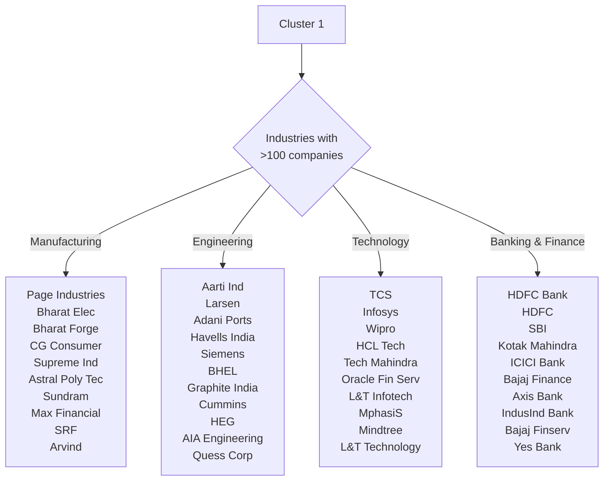
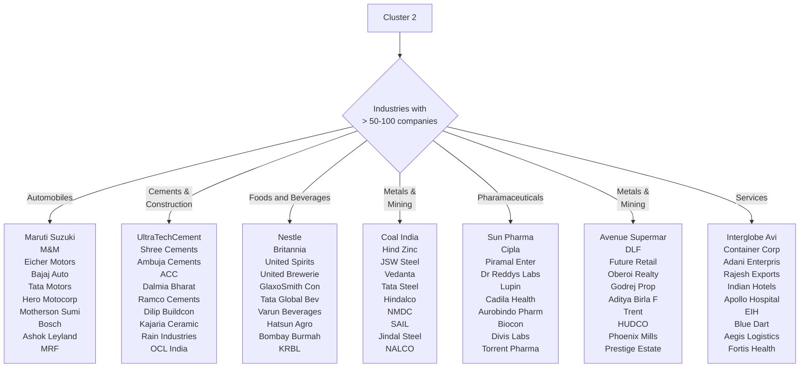
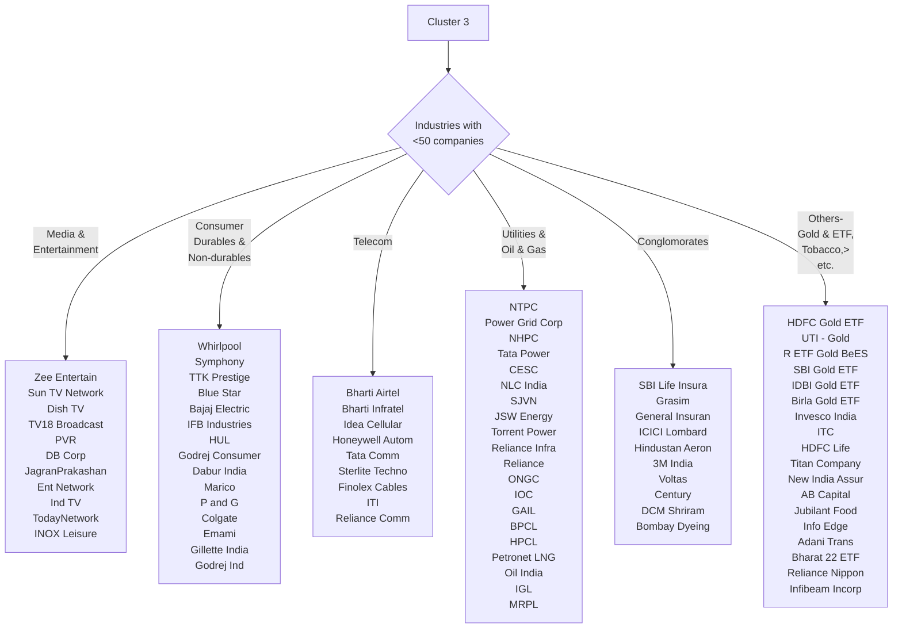

# National Stock Exchange of India

Put it simply, National Stock Exchange is a marketplace where the equity of publicly listed companies are traded. As of 13th August 2018, there are a total of 1638 companies listed on NSE. These companies could be categorised into 22 broad industries (one of which is miscallaneous). 

The list of industries are captured in the below list:

1. :blue_car: Automobiles
2. :bank: Banking/Finance
3. :construction: Cement/Construction
4. :microscope: Chemical
5. :office: Conglomerate
6. :tv: Consumer Durable
7. :bread: Consumer Non Durable
8. :wrench: Engineering
9. :fries: Food and Beverages
10. :moneybag: Gold ETF
11. :hammer: Manufacturing
12. :minidisc: Media & Entertainment
13. :man_with_gua_pi_mao: Metals and Mining
14. :rainbow: Miscallaneous
15. :factory: Oil and Gas
16. :pill: Pharmaceuticals
17. :department_store:Retail/Real Estate
18. :package: Services
19. :computer: Technology
20. :telephone_receiver: Telecom
21. :smoking: Tobacco
22. :nut_and_bolt: Utilities

Now let's try to answer some basic questions to get a better understanding of the NSE.

~~~
How big is NSE?
~~~

The total market capitalization of companies listed on the NSE is approximately $ 2.15 trillion. Now to give you an idea this is approximately equal to India's GDP in 2016 quoted by World Bank as $ 2.28 trillion.

~~~
What kind of companies constitute NSE?
~~~

To answer this question, we have divided companies into 7 categories based on the their market cap size.

```chart
{
  "type": "bar",
  "data": {
  "labels": [
    "<100 Cr",
    "100 Cr - 500 Cr",
    "500 Cr - 1000 Cr",
    "1K Cr - 5K Cr",
    "5K Cr - 10K Cr",
    "10K Cr - 50K Cr",
    ">50K Cr"
    
  ],
  "datasets": [
    {
    "label": "# of companies by market cap size",
    "data": [
      352,
    358,
162,
427,
99,
180,
61
    ],
    "backgroundColor": [
      "rgba(255, 10, 10, 0.2)",
      "rgba(175, 10, 10, 0.2)",
      "rgba(10, 206, 10, 0.2)",
      "rgba(10, 175, 10, 0.2)",
      "rgba(10, 150, 10, 0.2)",
      "rgba(10, 10, 164, 0.2)",
      "rgba(10, 10, 255, 0.2)"
    ],
    "borderColor": [
      "rgba(255, 10, 10, 0.2)",
      "rgba(175, 10, 10, 0.2)",
      "rgba(10, 206, 10, 0.2)",
      "rgba(10, 175, 10, 0.2)",
      "rgba(10, 150, 10, 0.2)",
      "rgba(10, 10, 164, 0.2)",
      "rgba(10, 10, 255, 0.2)"

    ],
    "borderWidth": 1
    }
  ]
  },
  "options": {}
}
```

~~~
How many companies are there in each industry?
~~~

The first cluster contains than 100 listed companies each.  In this cluster, most number of listed companies are in the Manufacturing industry (210), followed by Banking and Finance (167). The Engineering (131), Chemical (105) and Technology (105) industries are other members of this cluster. If you observe this cluster closely, you would notice that all most all of the industries are capital intesive this category.

The second cluster contains the industries having between 50-100 companies. Cement Construction (95) and Metals and Mining (89) are the leaders in the second cluster. Pharmaceuticals (85), Services (83), Food and beverages (80) and Automobiles (81). Real Estate (51) just makes this cluster.

The third cluster contains all the remaining industries. This cluster includes Media and Entertainment (47), Telecom (32), Conglomorates (30), Oil and Gas (21), Utilities (26), Consumer non-durables (29), Consumer durables (11) and all other 150 niche categories clubbed as others.

~~~
How do industries compare against each other based on their relative size?
~~~

The following table ranks the industries based on their total market capitalization (in INR thousand Cr) values:

Rank| Company  |Toal Market Cap (in INR thousand Cr)
----| ---------|---------------------------------
1|	Banking/Finance	|3416
2|	Technology	|1640
3|	Oil and Gas	|1463
4|	Automobiles	|1117
5|	Metals and Mining	|762
6|	Consumer Non Durable	|761
7|	Pharmaceuticals	|741
8|	Engineering	|682
9|	Miscallaneous	|588
10|	Chemical	|555
11|	Cement/Construction	|427
12|	Food and Beverages	|411
13|	Tobacco	|379
14|	Utilities	|364
15|	Conglomerate	|355
16|	Manufacturing	|353
17|	Retail/Real Estate	|312
18|	Telecom	|311
19|	Services	|273
20|	Media & Entertainment	|141
21|	Consumer Durable	|55
22|	Gold ETF	|1


~~~
Who are the topgun companies in each industry?
~~~

For this let's go cluster by cluster.

For the most crowded sector the list is captured in the below graph:






To give you an idea, the companies mentioned above alone constitute about INR 118 lakh crore of market capitalization or 78% or NSE's total market capitalization.

So that completes the introduction of NSE of India. Hope you enjoyed reading the article!